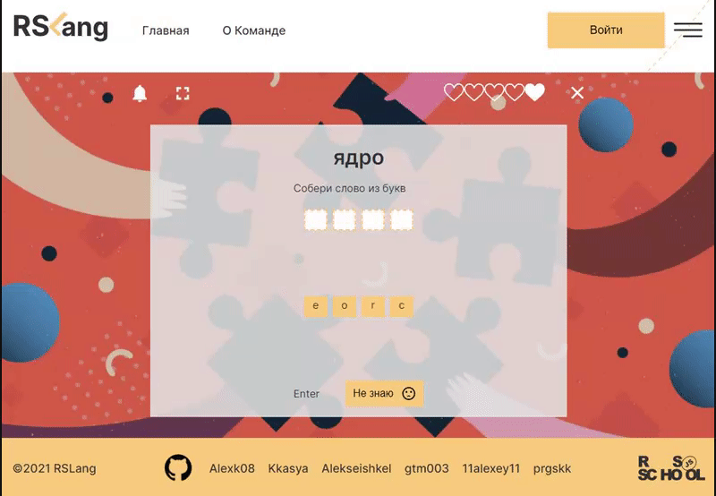

# [RSLang](https://rslang-team23-alexk08.netlify.app/)

Это командная работа, финальное задание курса обучения по библиотеке React RS School. Ссылка на техническое задание [здесь](https://github.com/rolling-scopes-school/tasks/blob/master/tasks/react/react-rslang.md).

## Технологии используемые в разработке:
### Код клиентской части написан на TypeScript, а также
* использованы библиотеки React / Redux / React-Router
* для построения графиков в статистике использована библитека [React Google Charts](https://react-google-charts.com/)
* для стилизации использован препроцессор SASS
